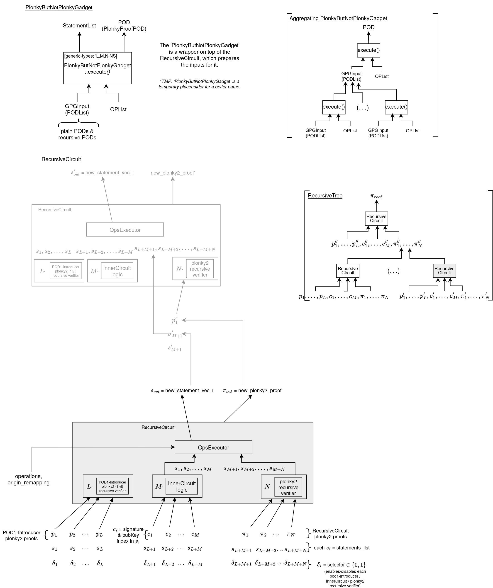

# pod2
Framework to build PODs that prove statements from other PODs recursively.


### Usage

The `PlonkyButNotPlonkyGadget` (name is placeholder for a better name), takes as inputs

- a list of named input PODs (which could be either Schnorr or Plonky PODs)
- the list of operations to be carried out on them as inputs.


Example usage:

Enumerate PODs you want to prove about:
```rust
let input_pods = [("some POD", schnorr_pod1), ("some other POD", schnorr_pod2)];
```

Enumerate operations:
```rust
let op_list = OpList(
        OpCmd(Op::None, "some out statement name"),
        OpCmd(
                Op::CopyStatement(StatementRef(&schnorr_pod1_name, "VALUEOF:s2")),
        "some other out statement name",
            ), ...
              );
```

Call the procedure
```rust
let plonky_pod = PlonkyButNotPlonkyGadget::<2,2,3>::execute(&input_pods, &op_list)?;
```

> Details with an example of usage can be found at the tests of [./src/lib.rs](./src/lib.rs).


The following diagram shows the different interfaces of the gadgets:


